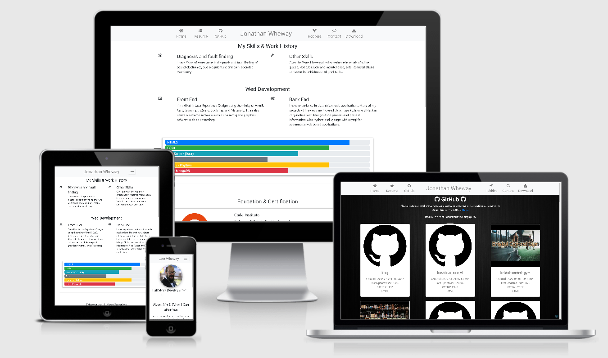
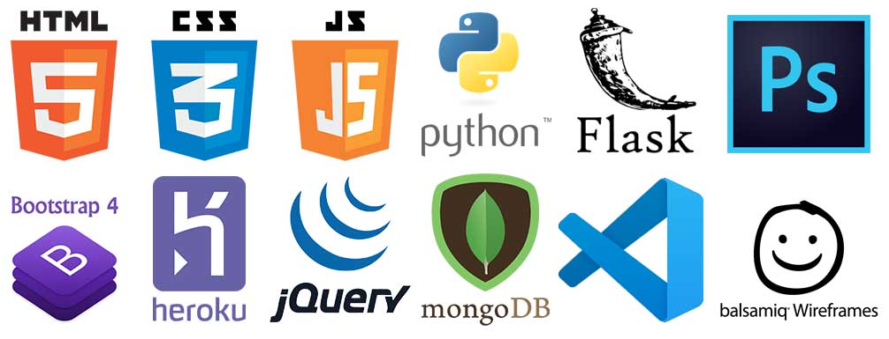

<h1 align="center">
   
 </h1>
 

    
#### Click on the image for live version.

Cv is an online resume aimed at potential future employers, to gain information about the qualities and qualifications of the proposed candidate.
Displaying a good array of there technical abilities. 

#### The users goals of this website are:
* To gain knowledge of the skills and personality of the potential employee.
* Displaying information and credentials in a clear and concise manner.
* Easy to navigate. 

#### The Business potentials of this website are:
* Making blank templates so users can create there own online CV.
* Become an ecommerce site selling templates and readymade CVs.

#### Visitors to this website are searching for:
* The candidate's education and skill levels.
* Work history.
* A portfolio of past and current projects.
* Readily available contact information.
* A downloadable pdf of a paper CV.

#### This Website is the best way to help them achieve these things because:
* Other websites are too cluttered and hard to navigate.
* The owner is able to create a login.
* A demonstration of a full stack website 
* The owner can create, update, delete and edit their blog posts.
* Their contact information is clearly displayed to the user on the landing page. 
* The navigation bar is large and clear on all pages.
* The contact form is easy to use.

#### This website is:
* Uncluttered and has an intuitive process of navigation.
* Providing clean and clear infomation on all pages.

## Features:
* All pages have a navigation bar across the top with links to home, Resume, Github, Hobbies, Contact and a Download button.
* The landing page has an about me section and contact infomation.
* Resume page displays skills, education with links to relevant certificates, employment history with details of the responsibilities of each role and links to the relevant company.
* GitHub page displays all the repositories of the owner's projects past and present.
* Hobbies is a work in progress but will contain a blog in the near future.
* Contact page has a contact form to send the owner eamils.
* Download is a link to a pdf of a paper CV.
* Footer contains social media links and copyright, the name on the copyright opens a login page for site admistartion.

#### Navigation: 
All pages contain the same navigation across the top and a footer to the bottom of the page. The top navigation bar consists of Home, Resume, GitHub, the owner's name that redirects to the home page when clicked, Hobbies, Contact and Download Buttons. All direct the user to the relevant locations. The footer contains social media links and copyright information the name on the copyright loads to the login page for site administration.

#### Home:
The landing page has navigation across the top and footer across the bottom, with the avatar image of the owner to the left of the page and a moving javascript banner to the right. Below that is an about me section with a sort piece of text followed by contact information. 

#### Resume:
The Resume page has navigation across the top and footer across the bottom, a section on skills and redevelopment followed by some representation bars to depict levels of competency of each skill. Below are education and certification with links to the relevant certificates. Below that again is employment history with bootstrap cards of each company and dates of service, on clicking the cards javascript injects information about the company and the responsibility that was undertaken for said role. Below a back to top button also when the page is displaying the company inflation a back to employment button appears taking you back to where you started in the employment section.

#### GitHub:
The GitHub page has navigation across the top and footer across the bottom, the GitHub logo and a link to the actual GitHub site below that is some text and the number of repositories that are being displayed. When the page is first loaded a javascript event listener calls the GitHub API and pulls down all the repositories in the owners GitHub and displayed them as bootstrap cards, While this is taking place an overlay with packman wizzing round and loading please wait is displayed, until the infomation from the API is recieved then the screen is cleared and the cards appear. When a card is clicked on you are taken to that specific repository. At the bottom of this page is a back to top button. 

#### Hobbies:
Under construction.

#### Contact:
The Contact page has navigation across the top and footer across the bottom, with a form across the middle of the page and a submit button below that. On submit, an overlay with packman wizzing round and loading please wait is displayed, while the infomation is being sent to via the emailJS API, once the infomation is sent the overlay clears and a thank you we have recieved you email message is injected via javascript. The API is linked to the owner's email account so all correspondence from the website is collected in the inbox of the owner.

#### Download
The download button take you to a new browser window and displays a pdf of the paper CV.

## Technology’s used will include:

   
 

                                                                                
[HTML5](https://en.wikipedia.org/wiki/HTML5), [CSS3](https://en.wikipedia.org/wiki/Cascading_Style_Sheets), [Bootstrap](https://getbootstrap.com/), [Javascript](https://en.wikipedia.org/wiki/JavaScript), [jQuery](https://jquery.com/), [Python3](https://www.python.org/), [VScode](https://code.visualstudio.com/), [Balsamiq Mockup 3](https://balsamiq.com/wireframes/desktop/), [Adobe Photoshop](https://www.adobe.com/uk/products/photoshop.html?gclid=EAIaIQobChMIzNru2Myo6AIVF-DtCh28Fgn0EAAYASAAEgKkdvD_BwE&sdid=88X75SKR&mv=search&ef_id=EAIaIQobChMIzNru2Myo6AIVF-DtCh28Fgn0EAAYASAAEgKkdvD_BwE:G:s&s_kwcid=AL!3085!3!394411736356!e!!g!!photoshop)
[MongoDB](https://www.mongodb.com/), [Flask](https://flask.palletsprojects.com/en/1.1.x/) and [Heroku](https://www.heroku.com/).
##

#### Database MongoDB Atlas:
MongoDB was used for this project and PyMongo is used to interact with the database.

The database has a two collections named blog and users.

 
## Blog

| Field         | Type     | Description                                |
| :------------ | :------- | :----------------------------------------- |
| \_id          | ObjectId | ID is auto-created by MongoDB              |
| name          | String   | Name of blog                               |
| title         | String   | Title of the blog                          |
| blog          | String   | The story                                  |
| image         | String   | URL of the image                           |
| created       | String   | Date the post was created                  |
| updated       | String   | Date the post was updated                  |

I chose the fields above for simplicity.

## users

| Field         | Type     | Description                                |
| :------------ | :------- | :----------------------------------------- |
| \_id          | ObjectId | ID is auto-created by MongoDB              |
| username      | String   | Name of user                               |
| email         | String   | Email address of user                      |
| password      | String   | Encrypted password of the user             |

I felt the login needed to be as simple as possible hence keeping to only three bits of user data.

#### Cross Browser Compatibility
Tested on four Browsers
* Chrome    Works as intended.
* Opera     Works as intended.
* Firefox   Some of the Css fails to loadbut the site dose function as intended.
* Edge      Alot of the Css fails to loadbut the site dose function as intended.

### Deployment:
##### To deploy this page to Heroku from its GitHub repository:

Log into GitHub.
Then clone this project from GitHub:

Follow this link to the Project's GitHub repository https://github.com/jonathanw82/cv
Under the repository name, click "Clone or download".
Select clone with HTTPs, copy the clone URL for the repository.

In your local IDE open Git Bash Terminal.
Change the current working directory to the location where you want the cloned directory to be made.
Type git clone, and then paste the URL you copied earlier.
(git clone "https://github.com/USERNAME/REPOSITORY")
Press Enter. Your local clone will be created.

Further reading and troubleshooting on cloning a repository from GitHub [here](https://help.github.com/en/github/creating-cloning-and-archiving-repositories/cloning-a-repository).

##### Forking the repository.
If you would like to take a copy of this repository in its current state, this can be done by forking.

Follow this link to the Project's GitHub repository https://github.com/jonathanw82/cv

From the menu items near the top of the page, select Fork.
On doing so the repository will be added to your own gitHub account. From there you can follow the deployment 
details as stated below. You will also be able to make any changes you require that will not affect the 
original master from the original repository.

##### How to deploy from Heroku
To deploy from Heroku, first sign up to do this go to https://www.heroku.com/
and click the sign up button on right hand side and fill out the form to create a new account,then select Python as the development language. 

At this point you will be sent a confirmation email, once the link in the email has been clicked you will be prompted to input a password and the account will be set up.

Once all setup and logged in, click on the create new app button, then give your project a name using hyphens instead of spaces. The name has to be unique as 
Heroku has thousands of apps and they cannot have the same name, select your region and select create app.

You will then be presented with a dashboard with listings of command lines for use in a bash command line.

From your workspace of choice open the command line and install Heroku depending on workspace, type (pip3 install heroku) once installed, type (heroku login -I)
then enter your email and password you set Heroku up with. It will then state you are logged in. 

We will now need to push our files to Heroku to be deployed or our live version.

To do this in Heroku go to the app you created earlier then select deploy, under app information you will see Heroku git URL copy the url, in the bash 
command line in the work space of choice type (heroku git:remote –a <app_name>) at this point you need to push all your data up to Heroku.

To do this from your git bash command line type (git add .) then (git commit –m “deploy to heroku”) then (git push –u heroku master ) this will take a few minutes to push all the data to 
Heroku. 

We then need to setup a web process to do this at the command prompt type (heroku ps:scale web=1) after this our web process will be running we will now need to set up some 
config Vars in heroku.

Go back to heroku go to settings click reveal config vars, there will be a few things to add here, first setup IP so in the box that says Key type (IP) and in 
the value box type (0.0.0.0) click add then do the same but type (PORT) and set that to (5000) click add. You will also need to add (MONGO_URI) and the (SECRET_KEY) for this information contact You site developer.

Once all the steps have been taken, click more top right hand side of page and select restart all dynos the application will now be deployed.

If a message pops up stating there may be some down time until the restart has finished click OK.

Under the settings tab in Heroku, scroll down to domains and your link will be displayed there. It can be used to access the live version of the application.

Deployment: The site will be deployed by 
https://www.heroku.com/

## Installed dependacies
passlib, 
dnspython,
pyMongo,
flask-pymongo

## Credit

## Media

gihub background image
https://wallpapercave.com/w/wp3082259
